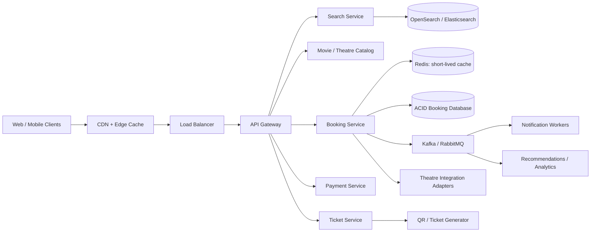

# BookMyShow-Style Movie Ticket Booking System

This project designs a high-concurrency movie and event ticketing platform. Users select a city, discover movies and theatres, inspect showtimes and live seat maps, place a temporary hold, pay, and receive a verifiable ticket. The design treats **seat allocation as a correctness-critical workflow**: no two successful transactions may sell the same seat.

## Requirements

Customers can select a city, search movies and theatres, view showtimes and seat layouts, select multiple seats, hold seats temporarily, pay, receive a QR ticket by email/SMS/push, and validate the ticket at entry. The platform also supports theatre integrations, recommendations, notifications, ratings, and operational analytics.

The key non-functional requirements are high concurrency during popular releases, ACID correctness for holds and payments, low-latency search and seat-map reads, high availability, FIFO fairness for requests contending for the same seats, secure payment handling, and real-time or near-real-time seat availability.

## Capacity assumptions

Capacity varies by market. A planning model should estimate active users, shows per day, seats per show, peak requests during blockbuster releases, and payment/notification fan-out. The booking path must be provisioned for a sharp burst rather than only the daily average. Search and static content can be served from CDN and caches; seat availability must have a short freshness window and a transactional source of truth.

## High-level architecture



The catalog, search, recommendation, and notification components scale independently from the booking service. Redis accelerates read-heavy seat-map requests and can coordinate short-lived holds, but the durable booking database or theatre's authoritative API must enforce uniqueness. Kafka or RabbitMQ carries ticket generation, notifications, analytics, and reconciliation events off the synchronous payment path.

## Theatre integration

Two integration models are supported. In a **reserved inventory** model, each aggregator receives a fixed seat allotment and reconciles inventory periodically. In a **dynamic inventory** model, the platform calls the theatre API for availability and booking, using an adapter per theatre partner. The adapter must support idempotency keys, timeouts, retries, reconciliation, and a clear distinction between a temporary hold and a confirmed theatre booking.

Theatre APIs should be treated as external dependencies: use circuit breakers, bounded retries, request signing, partner-specific rate limits, and a reconciliation job for uncertain payment or booking outcomes.

## Seat consistency and FIFO fairness

When a user selects seats, the booking service places a hold with a five-to-ten-minute expiration. A hold is not a sale. A request is placed in a per-show queue, and workers process requests in sequence. Before creating a hold, the worker atomically verifies that every requested seat is available. All seats in a multi-seat request succeed or fail together.

The durable transaction should enforce a uniqueness rule such as `(show_id, seat_id, active_booking)` or use a compare-and-set version on the show-seat row. Redis TTLs are useful for fast expiry, but a sweeper and database timestamps remain necessary because keys can expire late or be lost. Confirmation is idempotent by payment/order key. Expired and cancelled holds return seats to `AVAILABLE`.

A user who loses a race receives a clear conflict response and can refresh the seat map. The service should never infer success from a client timeout; it must expose an order-status endpoint for reconciliation.

## Data model

| Entity | Important fields | Storage |
|---|---|---|
| `City` | id, name, country | SQL |
| `Movie` | id, title, language, duration, genres, release date | SQL + search index |
| `Theatre` | id, city, address, partner id | SQL |
| `Screen` | id, theatre id, layout version | SQL |
| `Seat` | id, screen id, row, number, type | SQL |
| `Show` | id, movie id, screen id, start/end, status | SQL |
| `ShowSeat` | show id, seat id, state, hold id, version | SQL, partitioned by show |
| `Hold` | id, user id, show id, seat ids, expires at, state | SQL + Redis TTL |
| `Booking` | id, hold id, user id, payment id, state | SQL |
| `Ticket` | id, booking id, QR payload, issued at | SQL/object store |
| `Event` | booking/ticket/notification event | Kafka/event store |

Relational storage is the source of truth for theatres, screens, shows, seats, holds, bookings, and payments because those records require transactions and relationships. A distributed search store supports movie and theatre discovery. High-volume reviews, clickstreams, and recommendation features can use Cassandra or a warehouse after being derived from events.

## Core APIs

| Method | Endpoint | Purpose |
|---|---|---|
| `GET` | `/api/v1/cities` | List supported cities |
| `GET` | `/api/v1/movies?cityId=...` | List movies in a city |
| `GET` | `/api/v1/shows?movieId=...&cityId=...` | Find theatres and showtimes |
| `GET` | `/api/v1/shows/{showId}/seats` | Return a seat map and freshness metadata |
| `POST` | `/api/v1/shows/{showId}/holds` | Queue and hold selected seats |
| `GET` | `/api/v1/holds/{holdId}` | Check hold state and expiration |
| `POST` | `/api/v1/holds/{holdId}/confirm` | Authorize payment and issue booking |
| `POST` | `/api/v1/bookings/{bookingId}/cancel` | Cancel according to policy |
| `GET` | `/api/v1/tickets/{ticketId}` | Retrieve ticket and QR payload |
| `POST` | `/api/v1/tickets/{ticketId}/validate` | Validate entry at the theatre |

Create-hold requests should include an idempotency key. Successful confirmation returns the booking ID, ticket ID, payment state, show details, seat list, and notification status. Payment card details are tokenized by the payment provider and never stored by the ticketing platform.

## Booking workflow

1. The client searches catalog data from the search service and selects a show.
2. The seat service returns the current map, version, and last-updated timestamp.
3. The client submits a hold request with selected seats and an idempotency key.
4. A per-show FIFO worker validates availability and atomically creates a short-lived hold.
5. The user pays through the payment service. The payment callback is verified and deduplicated.
6. Booking service confirms the hold, calls the theatre adapter if required, and commits the booking and ticket transaction.
7. A booking event is published. Workers generate the QR document and send email/SMS/push notifications asynchronously.
8. At entry, the theatre scanner validates the signed QR payload and ticket state.

Payment success followed by an uncertain theatre response enters `PENDING_RECONCILIATION`, not an automatic duplicate retry. A reconciliation worker checks the partner, confirms the booking or refunds the payment, and notifies the user.

## Low-level reference implementation

[`BookMyShowBookingSystem.cpp`](BookMyShowBookingSystem.cpp) is a dependency-free C++17 reference implementation. It demonstrates:

- Show and seat inventory.
- FIFO request sequencing.
- Atomic all-or-nothing seat holds.
- Hold expiration and cancellation.
- Payment confirmation and ticket/QR issuance.
- Ticket validation.
- Mutex-protected concurrent access to in-memory state.

```bash
g++ -std=c++17 -Wall -Wextra -pedantic -pthread BookMyShowBookingSystem.cpp -o bookmyshow-booking
./bookmyshow-booking
```

## Scaling and reliability

Use a CDN for images and catalogue assets, Redis for short-lived catalogue/seat-map caching, search replicas for discovery, and horizontally scaled stateless API servers. Partition booking rows by show or theatre and use read replicas only for non-critical reads. Popular shows are hot partitions; isolate them, serialize updates per show, and use backpressure rather than allowing unlimited workers to contend on the same seats.

Monitor p95/p99 search and booking latency, hold success rate, hold expiry rate, double-booking invariant violations, payment failures, theatre partner latency, reconciliation backlog, notification lag, cache hit ratio, and ticket-validation failures. Encrypt data in transit and at rest, apply role-based access, sign partner requests, audit admin actions, rate-limit hold/payment endpoints, and protect against bots and credential abuse.
