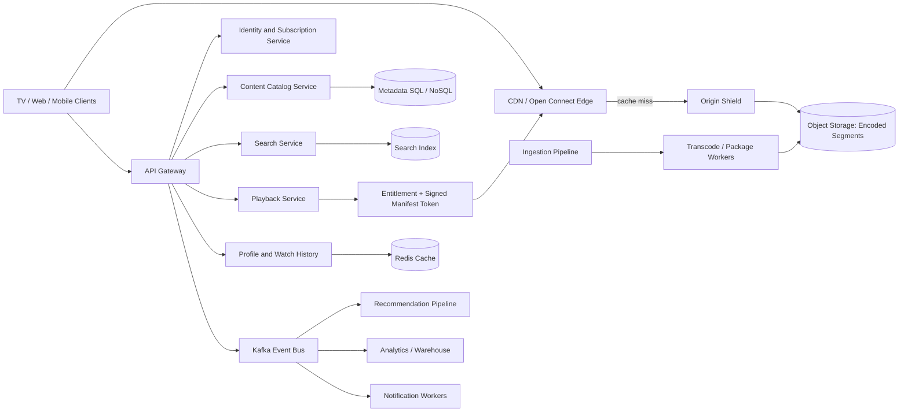

# Netflix-Style Video Streaming Platform

This project designs a global, highly available video-on-demand platform for browsing movies and series, searching content, streaming adaptively across devices, maintaining profiles and watch history, supporting watchlists and offline downloads, and generating personalized recommendations.

## Requirements

Users can register and authenticate, manage multiple profiles, browse and search movies or series, start playback, select adaptive quality, continue watching across devices, manage a watchlist, rate content, download eligible titles, and receive notifications. The platform must support millions of concurrent viewers, low startup latency, minimal buffering, regional fault tolerance, secure subscriptions, and efficient global delivery.

## Capacity estimation

| Metric | Assumption |
|---|---:|
| Registered users | 300 million |
| Daily active users | 100 million |
| Daily video views | 1 billion |
| Average source/title size | 500 MB for the simplified estimate |
| New videos/day | 100,000 |
| Read/write ratio | 1,000:1 |
| Average play requests | approximately 11,574 requests/second |
| New source storage | 50 TB/day, or 1.5 PB/month before replicas/backups |
| Streaming transfer estimate | approximately 500 PB/day, about 46 Tb/s average before CDN caching |

The source-size estimate is intentionally simplified. Real systems store multiple encoded renditions, audio tracks, subtitles, thumbnails, manifests, replicas, and backups. Most viewer bandwidth is served by regional edge caches rather than the origin.

## High-level architecture



The client requests metadata and playback authorization through the API gateway. Playback Service checks identity, subscription entitlement, region restrictions, and device policy, then issues a short-lived signed manifest URL. The client fetches HLS or MPEG-DASH manifests and segments from the nearest CDN edge. A cache miss flows through an origin shield to object storage. Playback progress and analytics are emitted asynchronously so they do not block video startup.

## Video ingestion and delivery

Content producers upload a master file to object storage. An ingestion workflow validates the file, extracts metadata, scans it, and creates jobs for a distributed transcoding pipeline. Workers produce multiple codecs, resolutions, bitrates, audio tracks, subtitles, thumbnails, and HLS/DASH manifests. The package is replicated to origin storage and gradually warmed into regional edge caches.

Adaptive bitrate streaming lets the client switch renditions based on measured throughput, buffer health, and device capabilities. CDN cache keys include content version and segment path; immutable segments can have long TTLs. Manifests and entitlement tokens have shorter TTLs. When a title is removed or a license expires, the catalog and authorization layer reject new sessions while a purge workflow handles cached assets.

## Data model and storage

| Entity | Important fields | Storage choice |
|---|---|---|
| `User` | id, email, auth provider, status | SQL |
| `Profile` | id, user id, name, maturity settings, preferences | SQL + cache |
| `Content` | id, title, type, genres, cast, regions, license dates | SQL/NoSQL + search index |
| `Asset` | content id, codec, resolution, bitrate, manifest path, version | NoSQL/object metadata |
| `Subscription` | user id, plan, status, renewal, entitlements | SQL |
| `WatchProgress` | profile id, content id, position, updated at | NoSQL, partitioned by profile |
| `Watchlist` | profile id, content id, created at | NoSQL or SQL |
| `Rating` | profile id, content id, rating, updated at | NoSQL/event stream |
| `PlaybackEvent` | session, profile, content, position, device, timestamp | Kafka + warehouse |

SQL is the source of truth for accounts, profiles, billing, and entitlements. A distributed NoSQL store supports high-volume watch progress and activity writes. Object storage holds media; only metadata and signed references belong in databases. Search indexes are rebuildable projections, not the source of truth.

## APIs

| Method | Endpoint | Purpose |
|---|---|---|
| `POST` | `/api/v1/auth/register` | Register an account |
| `POST` | `/api/v1/auth/login` | Authenticate a user |
| `GET` | `/api/v1/content` | Return home-page and personalized rows |
| `GET` | `/api/v1/content/{contentId}` | Return title details and availability |
| `GET` | `/api/v1/search?q=...` | Search titles, cast, genres, and keywords |
| `POST` | `/api/v1/profiles` | Create a profile |
| `POST` | `/api/v1/playback/sessions` | Authorize a playback session |
| `PUT` | `/api/v1/profiles/{id}/progress` | Save playback position |
| `POST` | `/api/v1/profiles/{id}/watchlist/{contentId}` | Add to watchlist |
| `DELETE` | `/api/v1/profiles/{id}/watchlist/{contentId}` | Remove from watchlist |
| `POST` | `/api/v1/downloads` | Authorize an offline download |

Example playback request:

```json
{
  "contentId": "movie_101",
  "profileId": "profile_001",
  "deviceType": "Smart TV",
  "desiredQuality": "AUTO"
}
```

Example response:

```json
{
  "sessionId": "playback_abc123",
  "manifestUrl": "https://cdn.example.test/movie_101/master.m3u8?token=short-lived-token",
  "quality": "adaptive",
  "expiresIn": 3600
}
```

## Playback flow

1. The client requests title metadata and confirms the title is available in the user’s region.
2. Playback Service authenticates the profile, checks subscription entitlement, device limits, parental controls, and concurrency limits.
3. A short-lived, signed manifest token is generated with content, profile, region, and expiry claims.
4. The client fetches the manifest and segments from the nearest CDN edge.
5. The client periodically emits progress and QoE events. Progress updates are idempotent and may be processed asynchronously.
6. Recommendation workers consume viewing events, update user embeddings/features, and refresh cached recommendation rows.

## Low-level reference implementation

[`NetflixStreamingSystem.cpp`](NetflixStreamingSystem.cpp) is a dependency-free C++17 reference implementation demonstrating:

- Content publishing and case-insensitive search.
- Multiple user profiles.
- Watchlist management.
- Playback session creation with an expiry time.
- Playback progress and genre-view tracking.
- Simple profile-based recommendations.
- Session validity checks.

```bash
g++ -std=c++17 -Wall -Wextra -pedantic -pthread NetflixStreamingSystem.cpp -o netflix-streaming
./netflix-streaming
```

## Reliability, security, and operations

Run APIs across zones and regions with health checks, autoscaling, circuit breakers, bounded retries, and regional failover. Keep playback data paths independent from recommendation, analytics, and notification failures. Use origin shielding and multi-CDN routing for resilience. Backpressure ingestion and transcode jobs rather than overloading object storage or encoders.

Protect accounts with OAuth2/JWT, MFA options, secure password handling, device/session management, and rate limits. Encrypt personal and subscription data in transit and at rest. Use signed, short-lived manifest URLs, DRM where licensing requires it, token binding or device limits, and audit logs for entitlement changes. Do not expose origin bucket URLs directly.

Measure time-to-first-frame, rebuffer ratio, bitrate switches, CDN hit ratio, origin egress, playback authorization latency, manifest errors, segment 404s, entitlement failures, progress lag, recommendation freshness, and regional error rates. These QoE metrics are more meaningful than API latency alone because a technically successful request can still produce a poor viewing experience.
