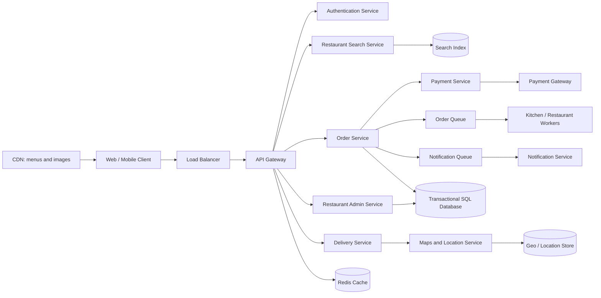

# Restaurant Management System — System Design

This project designs a restaurant platform that lets customers discover restaurants, browse menus, place dine-in or delivery orders, pay securely, track fulfillment, and submit ratings. Restaurant staff manage menus and orders, kitchen staff manage preparation, and delivery agents accept and track delivery jobs.

## Requirements

Functional requirements include registration and authentication, restaurant search by location/cuisine/rating, menu browsing, order placement, dine-in or delivery selection, payment-method selection, restaurant order management, kitchen status updates, delivery assignment and tracking, customer notifications, and ratings. Non-functional requirements are scalability during meal-time peaks, high availability, reliable order processing, strong consistency for menus/prices/payments/order state, and secure handling of personal and payment data.

## Capacity assumptions

| Metric | Estimate |
|---|---:|
| Restaurants | 10 million |
| Daily active users | 100 million |
| Average active-user traffic | approximately 1,160 requests/second |
| Average orders | 250,000/minute, approximately 4,200/second |
| Peak orders | 500,000/minute, approximately 8,300/second |
| Customer data | 100 GB at 1 KB/customer |
| Restaurant data | approximately 20 TB at 2 MB/restaurant |
| Order retention | approximately 77 TB for 72 million orders/day at 1 KB/order retained for 3 years |

These are planning estimates. Production capacity must also include indexes, replicas, photos, event streams, backups, retries, and regional failover headroom.

## High-level architecture



The client uses mobile, web, or desktop interfaces. An API gateway authenticates requests, applies rate limits, and routes traffic. Stateless services scale horizontally. SQL stores customers, restaurants, menus, orders, payments, and order state with ACID transactions. A search index supports location and cuisine queries, Redis caches popular restaurant/menu data, a CDN serves static images, and queues decouple order processing and notifications.

## Data model

**Customer** stores `customer_id`, name, addresses, phone, email, and authentication references. **Restaurant** stores `restaurant_id`, name, location, payment account, operating status, and owner/admin references. **MenuItem** stores `item_id`, restaurant ID, name, price, availability, and version. **DeliveryAgent** stores `agent_id`, contact information, vehicle number, payment account, availability, and current location.

**Order** stores `order_id`, customer ID, restaurant ID, optional agent ID, creation timestamp, order type, delivery address, item snapshot, item subtotal, delivery fee, payment transaction ID, and status. Item prices must be snapshotted at order creation so later menu changes do not change historical receipts. Status transitions should be validated by the order service and recorded in an append-only order-history table.

Ratings can be stored in a separate document or wide-column store because aggregate ratings tolerate eventual consistency. Payment card data should never be stored directly; use tokenized references returned by a compliant payment provider.

## APIs

| Method | Endpoint | Purpose |
|---|---|---|
| `POST` | `/api/v1/users` | Register a customer, staff member, or agent |
| `POST` | `/api/v1/auth/login` | Authenticate and issue a token |
| `GET` | `/api/v1/restaurants/search` | Search by location, cuisine, rating, and availability |
| `GET` | `/api/v1/restaurants/{id}/menu` | Retrieve the current menu |
| `POST` | `/api/v1/orders` | Place a dine-in or delivery order |
| `GET` | `/api/v1/orders/{id}` | Retrieve order details and status |
| `POST` | `/api/v1/orders/{id}/accept` | Restaurant accepts an order |
| `POST` | `/api/v1/orders/{id}/status` | Kitchen or restaurant updates status |
| `POST` | `/api/v1/orders/{id}/assign-agent` | Assign a delivery agent |
| `GET` | `/api/v1/orders/{id}/tracking` | Return delivery status and location |
| `POST` | `/api/v1/orders/{id}/ratings` | Submit restaurant or delivery rating |

Create-order requests should include an idempotency key to prevent duplicate charges and orders during retries. Return `400` for invalid input, `401/403` for authentication/authorization failures, `409` for stale menu versions or invalid state transitions, and `422` for unavailable items.

Example request:

```json
{
  "restaurantId": "abc123",
  "items": [{"itemId": "item1", "quantity": 2}],
  "orderType": "DELIVERY",
  "deliveryAddress": "123 Main St, City",
  "paymentMethod": "TOKENIZED_CARD"
}
```

## Order workflow

1. The customer registers or authenticates.
2. Restaurant Search Service returns nearby restaurants and cached menu data.
3. Order Service validates menu versions, availability, delivery range, pricing, and idempotency.
4. Payment Service authorizes the payment through an external gateway.
5. Order Service commits the order and publishes an event to the order queue.
6. Restaurant and kitchen workers accept the order and transition it through `PENDING`, `ACCEPTED`, `PREPARING`, and `READY`.
7. Dine-in customers receive a ready notification. Delivery orders are sent to Delivery Service, which finds a nearby available agent.
8. Map Service publishes location updates while the order is `OUT_FOR_DELIVERY`.
9. Successful delivery transitions the order to `DELIVERED`; notifications and ratings are processed asynchronously.

Payment authorization and order creation require a carefully designed transaction/outbox flow. If payment succeeds but order persistence fails, a retryable outbox or reconciliation worker must either complete the order or issue a refund.

## Microservices and storage choices

Authentication manages identities, tokens, roles, and secure registration. Search Service indexes restaurant metadata in Elasticsearch or OpenSearch. Order Service owns the order state machine and transactional SQL records. Payment Service integrates with Stripe, PayPal, UPI, or a bank gateway without storing raw card data. Delivery Service matches agents using geospatial queries and streams location updates. Notification Service consumes Kafka events and sends push, SMS, or email messages. A CDN stores menu images and static assets; Redis caches hot menus and short-lived availability data.

SQL is appropriate for customers, restaurants, menus, payments, and orders because these records require referential integrity and ACID transactions. NoSQL is appropriate for high-volume ratings, location samples, and event projections where flexible schemas and eventual consistency are acceptable. Search and analytics stores should be derived from transactional events rather than becoming the source of truth for orders.

## Reliability, security, and optimization

Deploy services across zones with health checks, load balancing, replicas, circuit breakers, bounded timeouts, retries with jitter, and dead-letter queues. Use database sharding by restaurant or region only after indexing and read replicas are insufficient. Cache static assets aggressively, but invalidate menu and price caches on version changes. Use asynchronous processing for notifications, analytics, and rating aggregation.

Use TLS in transit, encryption at rest, secret management, least-privilege service accounts, JWT/OAuth2 with role-based authorization, audit logs, input validation, rate limiting, fraud detection, and payment-provider tokenization. Protect location data and customer addresses with strict access controls and retention policies.

Monitor API latency and error rate, payment failures, order-state transition failures, queue lag, search freshness, cache hit ratio, agent assignment time, delivery SLA, and database saturation. Alerts should cover stuck orders, notification backlog, payment reconciliation mismatches, and regional health degradation.

## Reference implementation

[`RestaurantManagementSystem.cpp`](RestaurantManagementSystem.cpp) is a dependency-free C++17 executable that demonstrates menu management, dine-in/delivery order creation, totals, validated order-state transitions, delivery-agent assignment, and completion.

```bash
g++ -std=c++17 -Wall -Wextra -pedantic -pthread RestaurantManagementSystem.cpp -o restaurant-management
./restaurant-management
```

Expected output:

```text
Restaurant order checks passed
```
