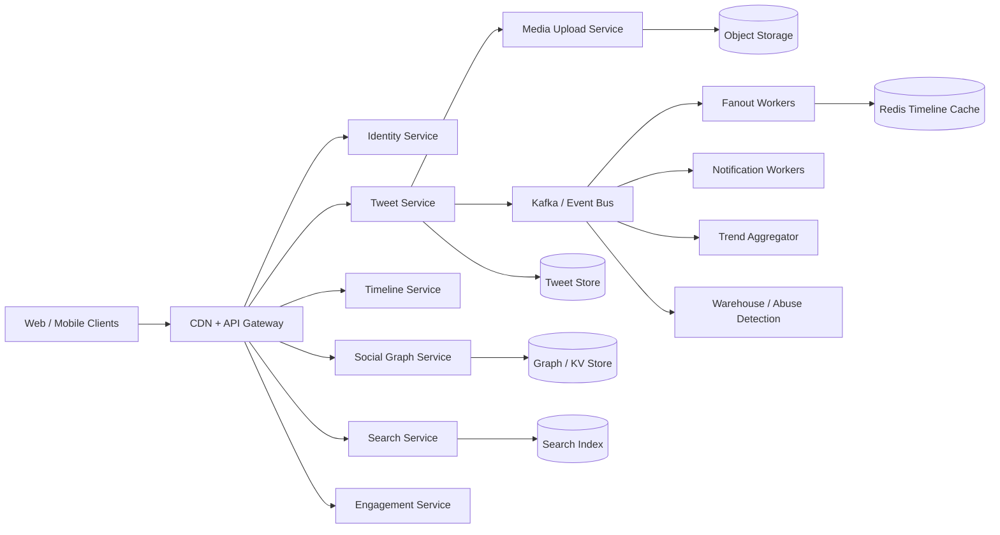

# Twitter-Style Social Platform

This project designs a read-heavy social platform where users publish text and media posts, follow accounts, consume home and profile timelines, like/repost/reply, search users and hashtags, receive notifications, and discover regional trends. The design emphasizes durable writes, low-latency reads, eventually consistent timelines, and a hybrid fan-out strategy for ordinary users and celebrity accounts.

## Requirements and capacity

Functional requirements are user identity and handles, tweet/media publishing, follows, home and profile timelines, likes, reposts, replies, search, notifications, trends, moderation hooks, and basic ranking. MVP non-goals are direct messages, audio spaces, ads, and advanced recommendations.

| Metric | Planning assumption |
|---|---:|
| Total users | 1 billion |
| Daily active users | 200 million |
| Tweets/day | 1 billion, approximately 11,574 writes/second |
| Home timeline reads/day | 6 billion, approximately 69,444 reads/second before peaks |
| Engagement writes | approximately 3 billion/day |
| Media posts | 10–15% of posts |
| Text storage | approximately 100 GB/day at 100 bytes/post |
| Media origin ingest | tens of TB/day depending on average asset size |

The platform should be provisioned for 5–10× read spikes, hot celebrities, viral hashtags, media fan-out, search-index lag, and multi-region replication overhead.

## High-level architecture



Identity owns users and immutable IDs. Tweet Service validates and durably stores posts, then emits events. Social Graph stores follow edges. Timeline Service reads a precomputed cache for ordinary users and merges recent celebrity posts at read time. Search indexes text and hashtags asynchronously. Media Service stores originals and renditions in object storage, while CDN serves thumbnails and videos.

## Timeline generation and fan-out

A **pull/fan-out-on-read** model stores each author’s tweets once and merges posts from followed accounts when a user opens the home page. It minimizes write amplification but can be expensive for users following thousands of accounts. A **push/fan-out-on-write** model writes a timeline entry into each follower’s inbox when a tweet is posted. It makes reads fast but becomes infeasible for a celebrity with millions of followers.

The recommended **hybrid** is push for normal accounts and pull for high-follower accounts. The fanout worker records a threshold and routes celebrity posts to a hot-author stream. Timeline reads merge cached inbox entries with a bounded set of hot-author posts, then rank by recency, engagement, affinity, and decay. Timeline entries are disposable projections; the tweet store remains the source of truth. Cache misses rebuild from recent event windows and follow edges.

## Snowflake-style identifiers

Use a 64-bit time-sortable ID containing an epoch timestamp, worker/datacenter identity, and per-millisecond sequence. Lease worker IDs from a control plane with TTL and stop issuing IDs if the lease is lost. On clock regression, fail fast or use a carefully monitored regression sequence. Tweet IDs are useful for cursor pagination, but tweet storage is normally sharded by author hash or time bucket to avoid a single hot partition.

Keep handles separate from immutable user IDs. A unique handle table supports rename operations without rewriting tweets, while a reverse mapping resolves the current handle for rendering.

## Data model

| Entity | Important fields | Storage |
|---|---|---|
| `User` | id, current handle, profile, status | SQL/KV |
| `FollowEdge` | follower id, followee id, created at | graph/KV store |
| `Tweet` | id, author id, text, media refs, created at, reply/repost refs | wide-column store |
| `Like` | user id, tweet id, created at | sharded KV/set |
| `TimelineEntry` | owner id, tweet id, score, created at | Redis + durable rebuild log |
| `Notification` | recipient, actor, type, object id, read state | KV store |
| `MediaAsset` | asset id, object path, codec, moderation state | object metadata + object storage |
| `TrendBucket` | region, hashtag, time bucket, count | stream aggregate store |

Use a durable append log and idempotent consumers for fanout, indexing, notifications, and analytics. Store media outside the tweet database. Search and trend indexes are derived and can be rebuilt from events.

## APIs

| Method | Endpoint | Purpose |
|---|---|---|
| `POST` | `/api/v1/tweets` | Publish a text/media tweet |
| `GET` | `/api/v1/timelines/home?cursor=...` | Retrieve the following timeline |
| `GET` | `/api/v1/users/{handle}/tweets?cursor=...` | Retrieve a profile timeline |
| `POST` | `/api/v1/users/{id}/follow` | Follow a user |
| `DELETE` | `/api/v1/users/{id}/follow` | Unfollow a user |
| `POST` | `/api/v1/tweets/{id}/likes` | Like a tweet |
| `POST` | `/api/v1/tweets/{id}/reposts` | Repost a tweet |
| `GET` | `/api/v1/search?q=...` | Search tweets, users, and hashtags |
| `GET` | `/api/v1/trends?region=...` | Return regional trends |
| `GET` | `/api/v1/notifications` | Retrieve notifications |

Tweet creation should accept an idempotency key and return the immutable tweet ID. Cursor pagination should use a time-sortable tweet ID and a tie-breaker rather than page numbers. Authorization and moderation checks happen before the tweet becomes visible.

## Low-level reference implementation

[`TwitterSocialSystem.cpp`](TwitterSocialSystem.cpp) is a dependency-free C++17 reference implementation demonstrating:

- Snowflake-style time-ordered tweet IDs.
- Immutable users and mutable follow relationships.
- Tweet creation with length validation.
- Home timelines from followed users plus the user’s own posts.
- Engagement likes and repost references.
- Simple engagement/recency ranking.
- Case-insensitive text search.
- Mutex-protected state.

```bash
g++ -std=c++17 -Wall -Wextra -pedantic -pthread TwitterSocialSystem.cpp -o twitter-social
./twitter-social
```

## Search, trends, notifications, and reliability

Index tweets asynchronously into Elasticsearch/OpenSearch with text, hashtag, author, and time fields. A stream processor counts hashtags in sliding time windows by region, applies velocity and spam controls, and publishes trend snapshots to Redis. Notifications are produced from follow, mention, like, and repost events and delivered through push providers with deduplication keys.

Deploy services across regions with replicated stores, rate limits, backpressure, circuit breakers, and dead-letter queues. Acknowledged tweets must be durable before returning success. Timeline, search, trend, and notification projections may lag by seconds. Protect the platform with moderation queues, abuse detection, media scanning, account security, privacy controls, and audit logs. Monitor tweet-write durability, fanout lag, timeline p99, cache hit ratio, search freshness, notification lag, hot-key load, and moderation backlog.
