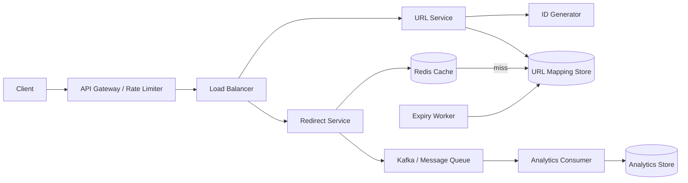

# URL Shortener: System Design

## 1. Problem and goals

The service converts long URLs into short, unique links and redirects users from a short code to the original destination. The critical path is read-heavy: redirects must remain low-latency and available while URL creation, analytics, expiration, and abuse controls operate safely around it.

Functional requirements are URL creation, custom aliases, redirects, expiration, disabling, and basic click statistics. Non-functional requirements are low latency, horizontal scalability, high availability, collision-free identifiers, durability, and protection from abusive or malicious links.

## 2. Capacity estimation

| Metric | Assumption |
|---|---:|
| New URLs per day | 10 million |
| Redirects per day | 1 billion |
| Average stored record | 500 bytes |
| Read/write ratio | 100:1 |
| Average redirect traffic | 1,000,000,000 / 86,400 = 11,574 RPS |
| Average create traffic | 10,000,000 / 86,400 = 116 RPS |
| Peak redirect target | 5 × average ≈ 58,000 RPS |
| Raw URL-record storage | 5 GB/day, approximately 1.8 TB/year |

The design should provision for peak traffic, replication overhead, indexes, backups, and hot-key traffic rather than only the averages.

## 3. High-level architecture



Creation writes the durable mapping before returning the short URL. Redirect first checks Redis, falls back to the mapping store, validates status and expiration, and returns an HTTP 301/302. Click events are emitted after the redirect decision so analytics cannot delay the user-facing path.

## 4. Data model

`UrlMapping(short_code PK, long_url, owner_id, created_at, expires_at, status, click_count, version)` is the primary record. The short code is the partition key and must have a unique constraint. `ClickEvent(short_code, occurred_at, request_id, country, device)` is append-only and belongs in a separate high-volume analytics store. `User(user_id, created_at, plan, status)` owns management permissions.

A cache value should include the destination, status, and expiration timestamp. Cache entries use a TTL no longer than the link expiration and are invalidated when a link is disabled or updated. Tombstones prevent a deleted alias from being immediately reused if that policy is required.

## 5. API design

| Method | Endpoint | Behavior |
|---|---|---|
| `POST` | `/api/v1/urls` | Create a generated or custom short URL |
| `GET` | `/{shortCode}` | Resolve and redirect to the destination |
| `GET` | `/api/v1/urls/{shortCode}` | Return metadata and status |
| `PUT` | `/api/v1/urls/{shortCode}` | Update expiration/settings |
| `DELETE` | `/api/v1/urls/{shortCode}` | Disable a link |
| `GET` | `/api/v1/urls/{shortCode}/stats` | Return aggregate click statistics |
| `GET` | `/api/v1/urls/{shortCode}/history` | Return paginated recent events |

Example create request:

```json
{
  "longUrl": "https://example.com/articles/system-design/url-shortener",
  "customAlias": "sysdesign",
  "expiresAt": "2026-12-31T23:59:59Z"
}
```

Return `201 Created` with `{ "shortCode": "sysdesign", "shortUrl": "https://short.ly/sysdesign", "status": "ACTIVE", "expiresAt": "2026-12-31T23:59:59Z" }`. Return `409 Conflict` for a taken alias, `400 Bad Request` for invalid URLs or dates, `404 Not Found` for unknown codes, and `410 Gone` for expired or disabled links.

## 6. Short-code strategy

A distributed numeric ID (Snowflake or database sequence range) encoded in Base62 provides compact, naturally unique codes without a retry-heavy random collision loop. Custom aliases use a conditional insert or unique constraint. If codes must be non-sequential, encrypt or permute the numeric ID before Base62 encoding; do not rely on obscurity as an authorization mechanism.

## 7. Scalability and reliability

Redis read-through caching handles popular links. Stateless URL and redirect service replicas scale horizontally behind a load balancer. The mapping store uses partitioning by short code, replicated reads, backups, and multi-zone deployment. A CDN or edge worker can cache very hot permanent redirects. Kafka decouples analytics, audit logs, and cleanup from redirects. An expiry worker scans an expiration index and invalidates cache entries.

Rate limits should separately protect URL creation and redirect traffic. Validate schemes, block private-network destinations where server-side fetching occurs, scan abuse reports, and enforce ownership checks on management APIs. Metrics should include p50/p95/p99 redirect latency, cache hit ratio, database errors, collision/alias conflicts, queue lag, expired-link responses, and per-code hotness.

## 8. Failure handling

If Redis is unavailable, redirect service falls back to the mapping store with circuit breaking and bounded timeouts. If analytics is unavailable, redirects still succeed and events are retried through a durable queue or outbox. If a mapping-store replica is stale, use the primary for newly created links or read-after-write consistency. A regional failure is handled with replicated mappings and regional traffic failover. Negative caching for missing codes reduces repeated database lookups, but its TTL must be short to avoid hiding newly created links.

## 9. Low-level design principles

`UrlService` owns validation and lifecycle operations; `RedirectService` owns resolution; `ShortCodeGenerator` is an abstraction allowing Base62, Snowflake, or another strategy; `MappingRepository` and `Cache` are interfaces in a service implementation. This separates responsibilities, supports dependency inversion, and permits replacing storage or ID generation without changing business rules. The reference C++ implementation in `URLShortenerSystem.cpp` demonstrates these boundaries in a compact, runnable form.
