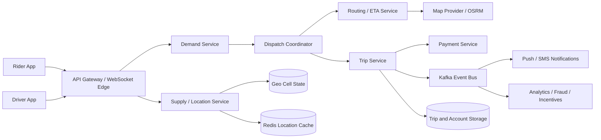

# Uber-Style Ride-Hailing and Dispatch System

This project designs a globally scalable ride-hailing platform. Riders see available vehicle options and ETAs, request a ride, track the driver, cancel when allowed, and pay after completion. Drivers publish location and availability, receive dispatch offers, navigate to pickup, and complete trips.

## Requirements and capacity

Functional requirements include rider and driver authentication, live driver locations, fare and ETA estimates, vehicle/accessibility filters, ride requests, driver matching, trip state updates, cancellation, payments, notifications, ratings, and trip history. Non-functional requirements are high availability, low latency, horizontal scalability, location freshness, exactly-once-ish ride assignment, privacy, and graceful handling of stale phones or unavailable drivers.

| Metric | Planning assumption |
|---|---:|
| Active users | 5 million |
| Active drivers | 200,000 |
| Rides/day | 1 million |
| User actions/day | 5 million, approximately 58 requests/second average |
| Driver location cadence | approximately every 4 seconds |
| Message storage estimate | 2.32 GB/day at 500 bytes/message for the simplified brief estimate |

The production system must plan for city-level peaks, driver location traffic, WebSocket fan-out, map-provider quotas, payment retries, and hot event venues rather than only global averages.

## High-level architecture



The Supply Service receives driver GPS updates, validates freshness, maps coordinates to geospatial cells, and maintains the latest available driver state. Demand Service creates rider requests and passes pickup cells and requirements to Dispatch. Dispatch owns a cell shard, finds nearby compatible drivers, requests road-network ETAs, and sends offers. Trip Service owns the authoritative ride state machine and payment lifecycle.

## Geospatial dispatch

Latitude/longitude should not be used as a direct database partition key. Encode coordinates into S2/H3/geohash cells. A pickup request identifies its cell; Dispatch searches that cell and expanding neighboring rings until it has enough compatible candidates. Cell ownership is distributed with consistent hashing. A membership protocol or service discovery system rebalances cell ownership as workers join or leave.

Candidate filtering checks availability, vehicle type, seats, child seat, wheelchair accessibility, driver freshness, and active-trip state. ETA ranking uses road distance and traffic rather than straight-line distance. A batch optimizer can reduce total wait time and deadheading, while a simple nearest-ETA policy provides a safe fallback when optimization is unavailable.

## Location and real-time behavior

Driver devices send location updates over an authenticated WebSocket or mobile transport approximately every four seconds. The location pipeline writes the latest state to an in-memory cell index and publishes durable events for history and analytics. Out-of-order updates are rejected using driver/session sequence numbers. A driver whose update is older than a freshness threshold is not eligible for dispatch.

Rider clients receive trip state and driver locations through WebSocket/SSE with polling fallback. Location data is privacy-sensitive: retain fine-grained traces only as long as needed, restrict access by trip and role, and aggregate historical data for analytics.

## Ride state machine

```text
REQUESTED -> DRIVER_ASSIGNED -> DRIVER_ARRIVED -> IN_PROGRESS -> COMPLETED
     |              |                 |
     +--------------+-----------------+----> CANCELLED
```

The Trip Service performs compare-and-set transitions. Assignment uses an idempotency key and a driver lease/offer token so two dispatch workers cannot assign the same driver. Offers expire after a short interval; a rejected or timed-out offer returns the driver to the candidate pool. Payment authorization, completion, refunds, and driver earnings are handled through an outbox/event workflow.

## Data model

| Entity | Key fields | Storage |
|---|---|---|
| `Rider` | id, contact, payment token, safety settings | SQL |
| `Driver` | id, vehicle, capabilities, status, rating | SQL + cache |
| `DriverLocation` | driver id, cell id, coordinates, sequence, timestamp | Redis/cell store + event log |
| `RideRequest` | id, rider, pickup, destination, requirements, state | SQL/NoSQL |
| `DispatchOffer` | ride id, driver id, lease token, expiry, response | durable trip store |
| `Trip` | id, assigned driver, route, fare, state, timestamps | SQL/NoSQL |
| `Payment` | trip id, provider reference, amount, status | SQL/payment provider |
| `LocationEvent` | driver/trip id, coordinates, timestamp | Kafka + warehouse |

Strong consistency is required for trip state, driver assignment, payment state, and idempotency. Eventual consistency is acceptable for map heatmaps, ratings, analytics, and rider-facing approximate driver positions.

## APIs

| Method | Endpoint | Purpose |
|---|---|---|
| `POST` | `/api/v1/rides/estimate` | Return vehicle options, fare, and ETA |
| `POST` | `/api/v1/rides` | Create a ride request with an idempotency key |
| `GET` | `/api/v1/rides/{rideId}` | Return trip state and assigned driver |
| `POST` | `/api/v1/rides/{rideId}/cancel` | Cancel according to policy |
| `POST` | `/api/v1/drivers/location` | Publish a location update |
| `POST` | `/api/v1/dispatch/offers/{id}/accept` | Driver accepts an offer |
| `POST` | `/api/v1/trips/{id}/arrived` | Driver reached pickup |
| `POST` | `/api/v1/trips/{id}/start` | Start the trip |
| `POST` | `/api/v1/trips/{id}/complete` | Complete trip and begin payment capture |
| `GET` | `/api/v1/rides/{rideId}/location` | Return current driver location |

## Low-level reference implementation

[`UberDispatchSystem.cpp`](UberDispatchSystem.cpp) is a dependency-free C++17 reference implementation demonstrating:

- Driver registration and GPS updates.
- Simple geospatial cell calculation.
- Availability and vehicle-type filtering.
- Nearest-driver dispatch within a radius.
- Assignment and trip state transitions.
- Completion, cancellation, and fare estimation.
- Mutex-protected shared state.

```bash
g++ -std=c++17 -Wall -Wextra -pedantic -pthread UberDispatchSystem.cpp -o uber-dispatch
./uber-dispatch
```

## Reliability, security, and operations

Use multi-zone stateless APIs, cell-sharded dispatch workers, replicated trip storage, durable event logs, circuit breakers around map and payment providers, and a reconciliation worker for uncertain operations. If the dispatch shard fails, ownership leases allow another worker to recover a cell. If the location stream fails, stale drivers are excluded rather than presented as available. If payment is delayed, the trip remains in a recoverable payment-pending state.

Use TLS, device authentication, rotating tokens, role-based access, payment tokenization, fraud detection, driver/rider safety controls, and audit trails. Rate-limit ride creation and location endpoints, reject impossible GPS jumps, and detect account or incentive abuse. Monitor assignment latency, search radius expansion, offer acceptance rate, stale-location rate, ETA error, cancellation rate, trip-state conflicts, payment failures, cell-worker health, WebSocket disconnects, and map-provider latency.
