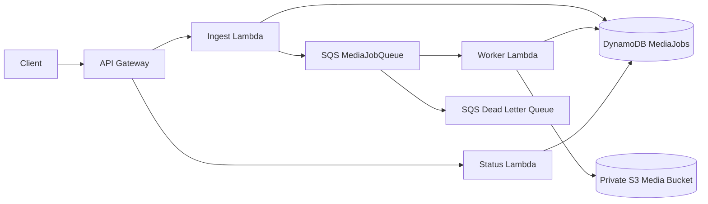

# AWS Event-Driven Media Processing Platform

A production-shaped AWS project for accepting media-processing jobs, persisting job state, processing work asynchronously, and exposing status to clients. It is intentionally small enough to understand end-to-end while demonstrating real cloud boundaries instead of listing services without implementation.

## What is genuinely used

| Technology | Actual use in this repository |
|---|---|
| **DynamoDB (NoSQL)** | `MediaJobsTable` stores job state by `jobId`; Lambda code uses `put_item`, `get_item`, and conditional/idempotent updates. NoSQL is used because this workload is key-value job status with high horizontal write/read scale and no relational joins. |
| **SQS** | `MediaJobQueue` decouples API ingestion from worker execution. It has a DLQ and retry policy; the worker is triggered by an SQS event source mapping. |
| **Lambda** | Separate `ingest`, `status`, and `worker` functions provide independently scalable service boundaries. |
| **API Gateway** | Exposes `POST /jobs` and `GET /jobs/{jobId}`. |
| **S3** | `MediaBucket` is private, encrypted, versioned object storage for uploaded and processed media assets. |
| **CI/CD** | `.github/workflows/ci-cd.yml` runs unit tests and SAM lint on pull requests/pushes, then builds and deploys to AWS from `main` using GitHub OIDC and an IAM role. |
| **Microservices/distributed systems** | The ingest API, status API, and asynchronous processor have separate deployment units and data boundaries. SQS provides durable distributed handoff, retries, backpressure, and a DLQ. |

This project does **not** pretend that every service is a microservice. Three independently deployable functions are enough for this bounded workflow; a larger domain should only be split further when ownership, scaling, or failure isolation requires it.

## Architecture



The synchronous path validates a request, writes a `QUEUED` record with a conditional expression, and sends a message. The worker transitions the job to `PROCESSING`, performs the media operation, and marks it `COMPLETED` with an output key. In production, the marked hook in `worker/handler.py` is where AWS Elemental MediaConvert or a containerized transcoder can be invoked. Duplicate SQS deliveries are safe because completed/processing jobs are skipped.

## Repository layout

```text
aws-event-media-platform/
├── src/
│   ├── ingest/handler.py       # POST /jobs
│   ├── status/handler.py       # GET /jobs/{jobId}
│   ├── worker/handler.py       # SQS consumer
│   └── shared/core.py
├── tests/test_platform.py      # AWS-free unit tests with fakes
├── template.yaml               # AWS SAM / CloudFormation
├── requirements.txt
└── .github/workflows/ci-cd.yml
```

## Local validation

The tests do not need AWS credentials:

```bash
cd aws-event-media-platform
python3 -m unittest discover -s tests -v
```

## Deploy to AWS

Install the [AWS SAM CLI](https://docs.aws.amazon.com/serverless-application-model/latest/developerguide/install-sam-cli.html), configure an AWS account, and run:

```bash
sam build
sam validate --lint
sam deploy --guided
```

The deployment creates the API, Lambdas, DynamoDB table, private encrypted S3 bucket, SQS queue, DLQ, event source mapping, and least-privilege policies. Do not commit AWS access keys. For CI/CD, create an IAM deploy role trusted through GitHub Actions OIDC, then configure these GitHub environment variables in the `production` environment:

- `AWS_REGION`, for example `ap-south-1`.
- `AWS_DEPLOY_ROLE_ARN`, the ARN of the narrowly scoped deployment role.

Create a SAM deployment configuration before enabling the deploy job:

```bash
sam deploy --guided
```

The workflow always runs tests and `sam validate --lint` first. Only a successful push to `main` can deploy.

## API examples

```bash
curl -X POST "$API_URL/jobs" \
  -H 'content-type: application/json' \
  -d '{"ownerId":"user-123","filename":"clip.mp4","contentType":"video/mp4"}'

curl "$API_URL/jobs/<jobId>"
```

## Production hardening

Add authentication and owner-level authorization at API Gateway/Cognito, presigned S3 upload URLs, antivirus/content validation, structured logging and tracing, DynamoDB TTL for old job records, KMS customer-managed keys, CloudWatch alarms, reserved concurrency, and a real MediaConvert or container worker. For large jobs, store progress and use Step Functions rather than keeping Lambda execution open. Keep the DLQ replayable and add an operator runbook for failed media jobs.
